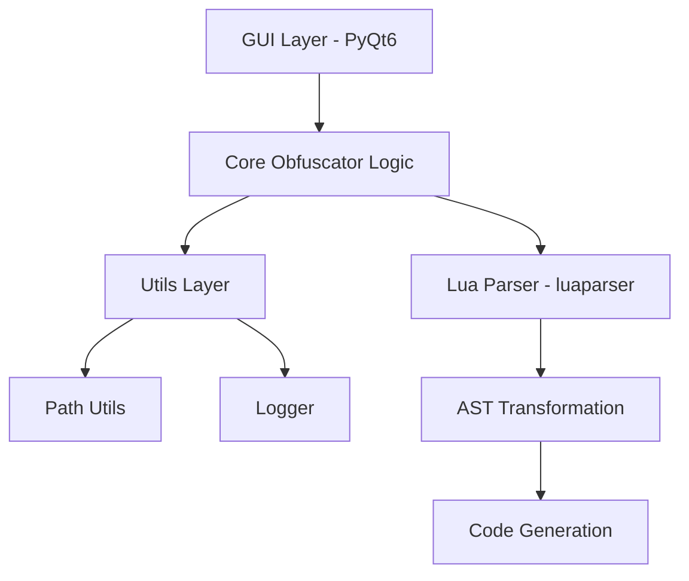
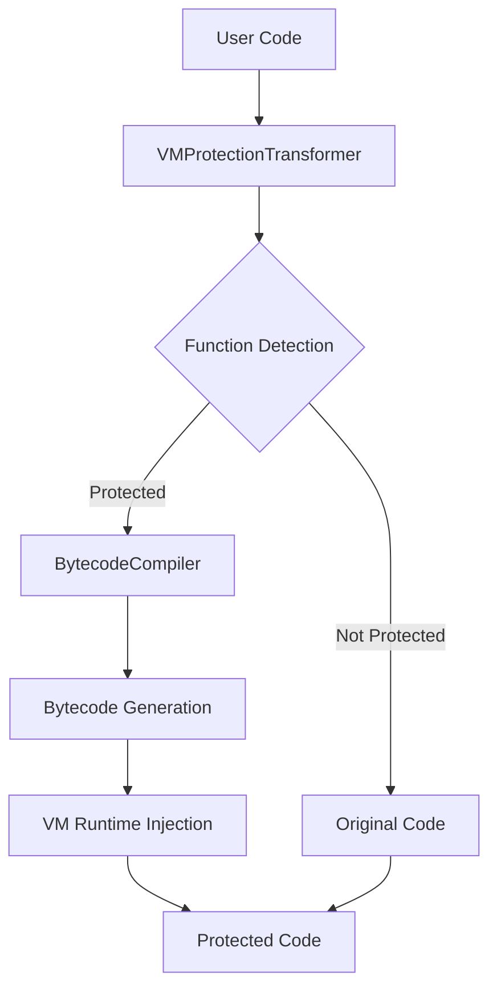

# Architecture

This document provides a technical overview of the **Obfuscator** project: a
cross-platform, GUI-based Lua code obfuscator built with Python and PyQt6.

The goal is to keep the architecture **simple, testable, and extensible**, while
supporting multiple platforms and future growth (GUI, plugins, configuration,
and advanced obfuscation strategies).

## Overview

- **Purpose:** Obfuscate Lua source code in a way that is harder to read or
  reverse engineer, while preserving runtime behavior.
- **Target users:** Lua developers, game developers, and tool authors who need
  to distribute Lua code with an additional layer of protection.
- **Design philosophy:**
  - Separation of concerns between GUI, obfuscation logic, and utilities
  - Strong unit test coverage and simple dependency structure
  - Cross-platform behavior via standard-library primitives and thin wrappers

## Technology Stack

| Component          | Choice                 | Notes                                      |
| ------------------ | ---------------------- | ------------------------------------------ |
| Language           | Python 3.9+           | Modern syntax, type hints, stdlib tooling |
| GUI Framework      | PyQt6 6.10.0          | Native-like, cross-platform GUI           |
| Lua Parser         | luaparser 4.0.0       | Lua AST parsing and manipulation          |
| Path Handling      | `pathlib` (stdlib)    | Cross-platform file system operations     |
| Testing            | pytest                 | Configured via `pyproject.toml`           |
| Code Quality       | black, flake8, mypy   | Formatting, linting, static analysis      |

For exact versions and platform notes, see
[`docs/dependencies.md`](dependencies.md).

## High-Level Architecture



- **GUI Layer:** PyQt6-based interface for selecting files, configuring
  obfuscation options, and running operations.
- **Core Obfuscator Logic:** Orchestrates parsing, transformation, and code
  generation.
- **Lua Parser:** Provides a parsed AST representation for Lua source code.
- **Utils Layer:** Shared helpers for paths, logging, and future common
  functionality.

## Module Structure

The Python package layout is centered around `src/obfuscator/`:

- `src/obfuscator/`
  - `utils/`
    - `src/obfuscator/utils/path_utils.py`  �� Cross-platform path utilities
    - `src/obfuscator/utils/logger.py`  �� Logging configuration and helpers
  - `gui/` *(planned)*  �� PyQt6-based widgets and application logic
  - `parser/` *(planned)*  �� Lua parsing and AST handling abstractions
  - `obfuscator/` *(planned)*  �� Core obfuscation engine and strategies

Test code lives under `tests/` and is wired via the `pytest` configuration in
`pyproject.toml`.

## Utility Modules

### Path Utils (`src/obfuscator/utils/path_utils.py`)

**Purpose:** Provide safe, cross-platform file system operations and platform
introspection.

**Typical responsibilities (non-exhaustive):**

- `normalize_path(path)`  �� Normalize and expand user-provided paths (e.g. `~`).
- `is_safe_path(base, target)`  �� Validate that `target` does not escape a
  trusted `base` directory (guards against path traversal).
- `validate_lua_file(path)`  �� Sanity checks for Lua source files.
- `get_platform()`  �� Return a normalized platform identifier
  (e.g. `"windows"`, `"macos"`, `"linux"`).
- Convenience helpers like `is_windows()`, `is_macos()`, `is_linux()`.

**Design notes:**

- Built on `pathlib.Path` for clean, idiomatic path handling.
- Centralizes platform differences in one place, simplifying higher-level code.

### Logger (`src/obfuscator/utils/logger.py`)

**Purpose:** Provide a configurable logging setup that supports both development
and future end-user builds.

**Key responsibilities:**

- `setup_logger(name, level, log_file, ...)`  �� Configure a named logger with
  console and file handlers.
- `add_file_handler(logger, path)`  �� Attach a rotating file handler
  (e.g. up to 10 MB, multiple backups).
- `set_log_level(logger, level)`  �� Dynamically change logging verbosity.

**Design notes:**

- Uses different formats for console vs log files (e.g. concise vs detailed).
- Designed so non-CLI entry points (like the GUI) can reuse the same logging
  configuration.

## Cross-Platform Considerations

Cross-platform behavior is a core architectural concern:

- **Path separators and encodings** are handled by `pathlib.Path`.
- **Home directory expansion** uses `Path.expanduser()` to support `~` on all
  major platforms.
- **Platform detection** is funneled through helpers in
  `src/obfuscator/utils/path_utils.py`.
- **GUI rendering** relies on PyQt6, which provides native look-and-feel on
  Windows, macOS, and Linux.
- **Linux/Wayland caveats** (e.g. environment variables, Qt platform plugins)
  are documented in more detail in `docs/dependencies.md`.

## Testing Strategy

Testing is centered around **pytest**, configured in `pyproject.toml`:

- Unit tests live under `tests/`, with utilities under `tests/utils/`.
- Integration tests (for combined behaviors) can be added alongside unit tests
  using the same naming patterns.
- Coverage reporting is enabled with `--cov` options and additional settings in
  the `[tool.coverage.*]` sections.

Examples of current patterns include modules such as
`tests/utils/test_path_utils.py`.

## Dependency Analysis and Orchestration

The obfuscator supports multi-file projects with cross-file symbol references
through a three-phase workflow:

### Three-Phase Workflow


1. **Phase 1 - Scan & Extract:** Parse all input files and extract symbols
   (functions, classes, variables) using language-specific extractors.

2. **Phase 2 - Build Graph & Pre-compute:** Construct a dependency graph from
   import statements, then build a global symbol table with pre-computed
   mangled names.

3. **Phase 3 - Obfuscate in Order:** Process files in topological order
   (dependencies first) using the frozen symbol table for consistent
   cross-file references.

### Core Components

| Component | Location | Purpose |
|-----------|----------|---------|
| `ObfuscationOrchestrator` | `core/orchestrator.py` | Coordinates the complete workflow |
| `DependencyGraph` | `core/dependency_graph.py` | Tracks file dependencies |
| `DependencyAnalyzer` | `core/dependency_graph.py` | Builds graph from imports |
| `GlobalSymbolTable` | `core/symbol_table.py` | Stores pre-computed mangled names |
| `SymbolTableBuilder` | `core/symbol_table.py` | Constructs symbol table from graph |
| `StringEncryptionTransformer` | `processors/ast_transformer.py` | Encrypts string literals |
| `ConstantFoldingTransformer` | `processors/ast_transformer.py` | Folds constant expressions |

### Symbol Table Architecture

The `GlobalSymbolTable` is **immutable after construction** (frozen), ensuring
consistent symbol mappings across all files:

- **Before freeze:** Symbols can be added via `add_symbol()`
- **After freeze:** Read-only access via `get_mangled_name()`, `get_symbol()`
- **Thread-safe:** Frozen table can be safely shared across processors

### Language-Specific Transformers

Each language uses idiomatic AST transformation patterns:

- **Python:** `NameManglingTransformer(ast.NodeTransformer)` with scope tracking
- **Lua:** `LuaNameManglingVisitor(luaparser.ast.ASTVisitor)` with scope tracking

Both transformers maintain `_scope_stack` and `_class_stack` to correctly
resolve symbol scopes during traversal.

### Error Recovery

The orchestrator implements graceful error handling:

- Parse errors are logged as warnings but don't stop processing
- Unresolved imports are logged but allow partial obfuscation
- Circular dependencies fall back to original file order with a warning

## String Encryption

The obfuscator provides string encryption to protect string literals from static
analysis. This feature encrypts string constants in the source code and injects
a decryption runtime that decrypts them at execution time.

### Encryption Approach

| Language | Algorithm | Library | Notes |
|----------|-----------|---------|-------|
| Python | AES-256-GCM | cryptography | Authenticated encryption with 12-byte nonce |
| Lua | XOR cipher | Native | Simple XOR for Lua runtime compatibility |

### Python String Encryption

For Python code, string literals are encrypted using AES-256-GCM (Galois/Counter
Mode), which provides both confidentiality and integrity:

1. **Key Generation:** A random encryption key is generated using `secrets.token_bytes()`
2. **Encryption:** Each string is encrypted with the key and a random 12-byte nonce
3. **Encoding:** Encrypted bytes are base64-encoded for embedding in code
4. **Runtime Injection:** A decryption function `_decrypt_string()` is injected at module level
5. **Replacement:** String literals are replaced with `_decrypt_string(encrypted_b64)` calls

```python
# Before encryption
message = "Hello, World!"

# After encryption (conceptual)
import base64 as _b64
from cryptography.hazmat.primitives.ciphers.aead import AESGCM as _AESGCM
_decrypt_key = _b64.b64decode("...")
_decrypt_iv = _b64.b64decode("...")
_decrypt_aesgcm = _AESGCM(_decrypt_key)

def _decrypt_string(encrypted_b64: str) -> str:
    encrypted_data = _b64.b64decode(encrypted_b64)
    decrypted = _decrypt_aesgcm.decrypt(_decrypt_iv, encrypted_data, None)
    return decrypted.decode("utf-8")

message = _decrypt_string("...")
```

### Lua String Encryption

For Lua code, a simpler XOR cipher is used due to limited cryptographic library
support in standard Lua:

1. **Key Generation:** Same random key generation as Python
2. **Encryption:** XOR each byte with the corresponding key byte (cycling)
3. **Encoding:** Encrypted bytes are embedded as escaped Lua string literals
4. **Runtime Injection:** A Lua decryption function is injected at chunk level

```lua
-- Decryption runtime (injected)
local _decrypt_key = "\123\45\67..."
local function _decrypt_string(encrypted_data)
    local result = {}
    local key_len = #_decrypt_key
    for i = 1, #encrypted_data do
        local encrypted_byte = string.byte(encrypted_data, i)
        local key_byte = string.byte(_decrypt_key, ((i - 1) % key_len) + 1)
        result[i] = string.char(encrypted_byte ~ key_byte)
    end
    return table.concat(result)
end
```

### Configuration Options

| Option | Type | Default | Description |
|--------|------|---------|-------------|
| `string_encryption_key_length` | int | 16 | Encryption key length in bytes (16, 24, or 32 for AES) |

### Security Considerations

- **Python AES-GCM:** Provides authenticated encryption; tampering with ciphertext will cause decryption to fail
- **Lua XOR:** Less secure than AES; provides obfuscation but not cryptographic security
- **Key Storage:** Encryption keys are embedded in the obfuscated code; determined attackers can extract them
- **Purpose:** String encryption is meant to deter casual inspection, not protect against sophisticated reverse engineering

### String Filtering

The transformer skips certain strings to avoid breaking functionality:

- Empty strings
- Strings shorter than `min_string_length` (default: 3 characters)
- Module docstrings (first string in a module body)

## VM Protection

The obfuscator provides VM-based code protection that converts functions to custom bytecode executed by a virtual machine. This provides strong obfuscation by hiding the original code structure.

### VM Protection Architecture



### Bytecode Instruction Set

The VM uses a custom bytecode instruction set with three complexity levels:

**Basic (Level 1):**
- `LOAD_CONST`, `LOAD_VAR`, `STORE_VAR`
- `BINARY_ADD`, `BINARY_SUB`
- `JUMP`, `JUMP_IF_FALSE`
- `CALL_FUNC`, `RETURN`

**Intermediate (Level 2):** Adds
- `BINARY_MUL`, `BINARY_DIV`, `BINARY_MOD`
- `COMPARE_EQ`, `COMPARE_LT`, `COMPARE_GT`
- `LOAD_GLOBAL`, `STORE_GLOBAL`
- `POP`, `DUP`

**Advanced (Level 3):** Adds
- `BINARY_POW`, `UNARY_NOT`, `UNARY_NEGATIVE`
- `LOAD_ATTR`, `STORE_ATTR`
- `BUILD_LIST`, `BUILD_MAP`
- `LOAD_INDEX`, `STORE_INDEX`

### VM Protection Process

1. **Function Identification:** Detect functions marked with `@vm_protect` decorator or comment marker
2. **Bytecode Compilation:** Convert function AST to custom bytecode instructions
3. **Runtime Generation:** Inject VM interpreter capable of executing the bytecode
4. **Wrapper Generation:** Replace original function with wrapper that invokes the VM

### Python VM Runtime

The Python VM runtime provides a stack-based virtual machine:

```python
class BytecodeVM:
    def __init__(self, bytecode, constants, num_locals, globals_dict):
        self.bytecode = bytecode
        self.constants = constants
        self.stack = []
        self.locals = [None] * num_locals
        self.ip = 0  # Instruction pointer
    
    def execute(self):
        while self.ip < len(self.bytecode):
            opcode = self._fetch()
            self._dispatch(opcode)()
```

### Lua VM Runtime

The Lua VM runtime provides similar functionality using Lua tables:

```lua
local BytecodeVM = {}
function BytecodeVM:new(bytecode, constants, num_locals)
    local vm = {
        bytecode = bytecode,
        constants = constants,
        stack = {},
        locals = {},
        ip = 1
    }
    for i = 1, num_locals do
        vm.locals[i] = nil
    end
    return vm
end
```

### Configuration Options

| Option | Type | Default | Description |
|--------|------|---------|-------------|
| `vm_protection_complexity` | int | 2 | VM instruction set complexity (1-3) |
| `vm_protect_all_functions` | bool | False | Protect all functions automatically |
| `vm_bytecode_encryption` | bool | True | Encrypt bytecode data |
| `vm_protection_marker` | string | "vm:protect" | Decorator/comment marker for protection |

### Security Considerations

- **Bytecode Encryption:** Optional AES encryption of bytecode prevents static analysis
- **Runtime Obfuscation:** VM runtime itself can be obfuscated with other transformers
- **Instruction Randomization:** Opcodes can be randomized per module
- **Anti-Tampering:** Integrity checks can detect bytecode modification
- **Performance:** VM interpretation adds 5-20x overhead; use selectively

### Limitations

- **Function Size:** Small functions (< 3 statements) are excluded to avoid overhead
- **Unsupported Features:** Generators, async functions, and complex decorators are skipped
- **Debugging:** Protected functions are harder to debug due to bytecode interpretation
- **Not Foolproof:** Determined attackers can still reverse engineer by analyzing runtime behavior

### Performance Impact

- **Overhead:** VM interpretation adds 5-20x execution overhead compared to native code
- **Code Size:** Protected functions increase code size by 2-4x due to bytecode and runtime
- **Recommendation:** Only protect critical functions, not entire codebase
- **Optimization:** Use complexity level 1 for performance-critical code

## Future Architecture

Planned architectural extensions include:

- **GUI module:** A structured set of PyQt6 widgets and dialogs for managing
  projects, selecting files, and visualizing obfuscation results.
- **Parser module:** Thin wrappers over luaparser to provide higher-level
  primitives for working with Lua ASTs.
- **Obfuscation engine:** A strategy-based system for applying transformations
  (renaming, control-flow flattening, string encoding, etc.).
- **Configuration management:** Persistent user settings and obfuscation
  profiles.
- **Plugin system:** A way to register and discover custom obfuscation
  strategies.

## Design Principles

- **Separation of concerns:** Keep GUI, core logic, and utilities loosely
  coupled.
- **Testability:** Favor small, pure functions and dependency injection where
  practical.
- **Extensibility:** Design modules so new backends, strategies, and UI
  components can be added without major rewrites.
- **Cross-platform compatibility:** Avoid OS-specific assumptions; isolate
  unavoidable platform differences in utility modules.
- **Type safety:** Use type hints consistently to improve readability and enable
  static analysis.
