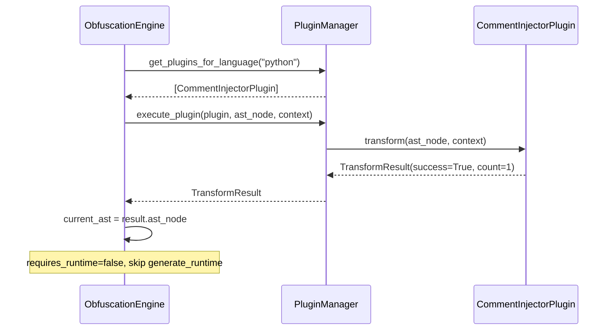

# Plugin API Reference

## Overview
The ScriptShield plugin system allows developers to create custom transformations that run **after** all core obfuscation passes. Plugins receive the fully-obfuscated AST, enabling custom code injection, metadata appending, or specialized modifications without interfering with the core engine's state or guarantees.

## Directory Layout
Plugins are automatically discovered from the `~/.obfuscator/plugins/` directory by default. Each plugin must be in its own subdirectory containing at least a `plugin.json` metadata file and a `plugin.py` implementation file.

```
~/.obfuscator/plugins/
└── <plugin_name>/
    ├── plugin.json   ← metadata
    └── plugin.py     ← implementation
```

> **Note:** The plugin directory can be overridden programmatically when constructing `PluginManager(plugin_dir=...)`.

## `plugin.json` Field Reference
The `plugin.json` file defines the metadata and execution requirements for your plugin. It must strictly adhere to this schema:

| Field | Type | Required | Description |
|---|---|---|---|
| `name` | `string` | ✅ | Unique plugin identifier (used as the folder name convention) |
| `version` | `string` | ✅ | Semantic version string (e.g., "1.0.0") |
| `author` | `string` | ✅ | Plugin author name |
| `description` | `string` | ✅ | Human-readable description of what the plugin does |
| `supported_languages` | `array[string]` | ✅ | Non-empty array; valid values are `"python"` and/or `"lua"` |
| `priority` | `integer` | ✅ | Execution order; lower numbers run earlier |
| `requires_runtime` | `boolean` | ✅ | Whether the core engine should call `generate_runtime()` |

## `ObfuscatorPlugin` ABC Contract
Your `plugin.py` must define a class that inherits from `obfuscator.core.plugin_interface.ObfuscatorPlugin`.

The class must implement:
- `transform(self, ast_node, context: PluginContext) -> TransformResult`: **Required.** Receives the raw AST (`ast.Module` for Python, `lua_nodes.Chunk` for Lua) and must return a `TransformResult`.

The class may optionally implement:
- `generate_runtime(self, context: PluginContext) -> str`: **Optional.** Only called when `requires_runtime = true` in `plugin.json`. The default implementation returns an empty string `""`.

### `TransformResult` Fields
Every `transform()` call must return a `TransformResult` object:

| Field | Type | Description |
|---|---|---|
| `ast_node` | `Any` | The (possibly modified) AST. If no changes were made, pass the original node. |
| `success` | `bool` | Always return `True` from plugins (the engine handles actual errors). |
| `transformation_count` | `int` | Number of nodes modified by your plugin. |
| `errors` | `list[str]` | Non-fatal warnings or messages. These do not abort the pipeline. |

## `PluginContext` Fields
The `context` argument passed to both `transform()` and `generate_runtime()` contains:

| Field | Type | Description |
|---|---|---|
| `config` | `ObfuscationConfig` | Full obfuscation configuration (read-only). |
| `symbol_table` | `GlobalSymbolTable \| None` | Pre-computed symbol mappings (may be `None` depending on the pipeline stage). |
| `language` | `str` | The current target language (`"python"` or `"lua"`). |

## Priority Ordering
Plugins are sorted ascending by their `priority` field before execution.
- Lower numbers (e.g., `10`) run first.
- Higher numbers (e.g., `100`) run later.
- **Core transformers always run before any plugin**, regardless of the plugin's priority value.

## Error Isolation Guarantees
The `PluginManager` is designed to be highly resilient:
- `PluginManager.execute_plugin()` wraps every `transform()` call in a `try/except` block.
- On any unhandled exception within your plugin, the failure is logged (via `get_logger`), the original AST is returned unchanged, and the pipeline continues.
- **Plugin failures never abort the core obfuscation job.**

## Runtime Code Injection
If your plugin needs to inject supporting functions into the final source code, set `requires_runtime: true` in your `plugin.json` and implement `generate_runtime()`.

**Execution Flow:**
1. Core engine calls `transform()`.
2. Core engine checks `requires_runtime`.
3. If true, it calls `plugin.generate_runtime(context)`.
4. The returned string is stored in `engine.plugin_runtimes[plugin.metadata.name]`.
5. During output generation, `prepare_embedded_runtime()` appends your plugin's runtime string alongside the core runtimes at the top of the file.

## Example Plugin Walkthrough
Let's look at the `comment_injector` example (found in `examples/plugins/comment_injector/`).

1. **The JSON Metadata:** It uses `priority: 100` to ensure it runs after most other plugins and `requires_runtime: false` because it only injects a simple AST comment, not helper functions.
2. **The Python Path:** It creates an `ast.Expr(ast.Constant(...))` node, calls `ast.fix_missing_locations()` so the unparser doesn't crash, and prepends it to `ast.Module.body`.
3. **The Lua Path:** It guards the `luaparser.astnodes` import. If available, it creates a `lua_nodes.Comment` and prepends it to the chunk body.
4. **The Result:** It returns a `TransformResult` with `success=True` and `transformation_count=1`.

### Execution Flow Sequence



## Installation
To install a plugin:
1. Copy your plugin directory into `~/.obfuscator/plugins/<plugin_name>/`.
2. Restart the ScriptShield application.
3. The `PluginManager` will automatically discover and load the plugin on initialization.
